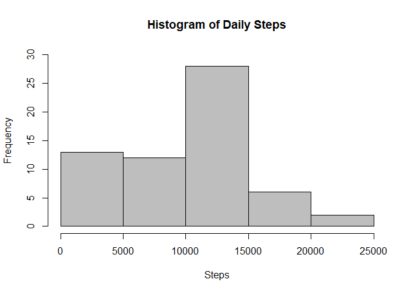
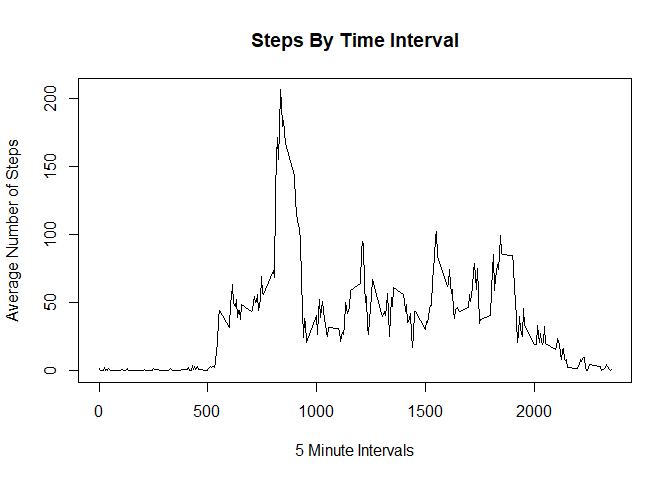
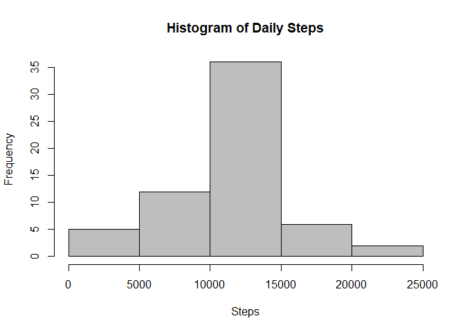
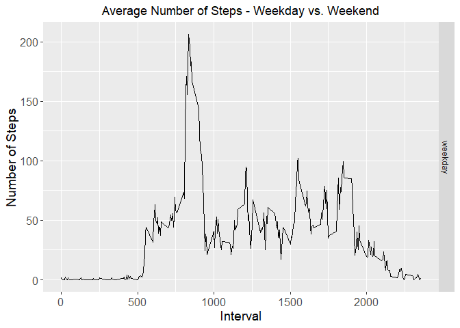

## Load libraries


```r
library(dplyr)
```

```
## 
## Attaching package: 'dplyr'
```

```
## The following objects are masked from 'package:stats':
## 
##     filter, lag
```

```
## The following objects are masked from 'package:base':
## 
##     intersect, setdiff, setequal, union
```

```r
library(ggplot2)
```


## Loading and preprocessing the data


```r
activity <- read.csv("./activity.csv")
activity$date <- as.Date(activity$date)
```

## What is mean total number of steps taken per day?


```r
stepsPerDay <- activity %>%
        group_by(date) %>%
        summarize(sumsteps = sum(steps, na.rm = TRUE)) 
```

```
## `summarise()` ungrouping output (override with `.groups` argument)
```

```r
#Display first 10 rows of data
head(stepsPerDay,10)
```

```
## # A tibble: 10 x 2
##    date       sumsteps
##    <date>        <int>
##  1 2012-10-01        0
##  2 2012-10-02      126
##  3 2012-10-03    11352
##  4 2012-10-04    12116
##  5 2012-10-05    13294
##  6 2012-10-06    15420
##  7 2012-10-07    11015
##  8 2012-10-08        0
##  9 2012-10-09    12811
## 10 2012-10-10     9900
```

```r
hist(stepsPerDay$sumsteps, main = "Histogram of Daily Steps", 
     col="gray", xlab="Steps", ylim = c(0,30))
```

<!-- -->

### Total number of steps taken per day


```r
sum(stepsPerDay$sumsteps)
```

```
## [1] 570608
```

### Mean and median of the total number of steps taken per day


```r
mean(stepsPerDay$sumsteps)
```

```
## [1] 9354.23
```


```r
median(stepsPerDay$sumsteps)
```

```
## [1] 10395
```

## What is the average daily activity pattern?


```r
stepsPerInterval <- activity %>%
        group_by(interval) %>%
        summarize(meansteps = mean(steps, na.rm = TRUE)) 
```

```
## `summarise()` ungrouping output (override with `.groups` argument)
```

```r
plot(stepsPerInterval$meansteps ~ stepsPerInterval$interval,
     col="black", type="l", xlab = "5 Minute Intervals", ylab = "Average Number of Steps",
     main = "Steps By Time Interval")
```

<!-- -->

```r
print(paste("Interval containing the most steps on average: ",stepsPerInterval$interval[which.max(stepsPerInterval$meansteps)]))
```

```
## [1] "Interval containing the most steps on average:  835"
```


```r
print(paste("Average steps for that interval: ",round(max(stepsPerInterval$meansteps),digits=2)))
```

```
## [1] "Average steps for that interval:  206.17"
```


## Imputing missing values


```r
print(paste("The total NA is: ",sum(is.na(activity$steps))))
```

```
## [1] "The total NA is:  2304"
```

```r
activityNoNA <- activity  
for (i in 1:nrow(activity)){
        if(is.na(activity$steps[i])){
                activityNoNA$steps[i]<- stepsPerInterval$meansteps[activityNoNA$interval[i] == stepsPerInterval$interval]
        }
}

stepsPerDay <- activityNoNA %>%
        group_by(date) %>%
        summarize(sumsteps = sum(steps, na.rm = TRUE)) 
```

```
## `summarise()` ungrouping output (override with `.groups` argument)
```

```r
head(stepsPerDay,10)
```

```
## # A tibble: 10 x 2
##    date       sumsteps
##    <date>        <dbl>
##  1 2012-10-01   10766.
##  2 2012-10-02     126 
##  3 2012-10-03   11352 
##  4 2012-10-04   12116 
##  5 2012-10-05   13294 
##  6 2012-10-06   15420 
##  7 2012-10-07   11015 
##  8 2012-10-08   10766.
##  9 2012-10-09   12811 
## 10 2012-10-10    9900
```

```r
hist(stepsPerDay$sumsteps, main = "Histogram of Daily Steps", 
     col="gray", xlab="Steps")
```

<!-- -->


```r
meanPostNA <- round(mean(stepsPerDay$sumsteps), digits = 2)
medianPostNA <- round(median(stepsPerDay$sumsteps), digits = 2)

print(paste("Mean: ", mean(meanPostNA)))
```

```
## [1] "Mean:  10766.19"
```

```r
print(paste("Median: ", median(medianPostNA)))
```

```
## [1] "Median:  10766.19"
```

### The mean increases from 9354.23 to 10766.19.


## Are there differences in activity patterns between weekdays and weekends?


```r
activityDoW <- activityNoNA
activityDoW$date <- as.Date(activityDoW$date)
activityDoW$day <- ifelse(weekdays(activityDoW$date) %in% c("Saturday", "Sunday"), "weekend", "weekday")
activityDoW$day <- as.factor(activityDoW$day)
```


```r
activityWeekday <- filter(activityDoW, activityDoW$day == "weekday")
activityWeekend <- filter(activityDoW, activityDoW$day == "weekend")

activityWeekday <- activityWeekday %>%
        group_by(interval) %>%
        summarize(steps = mean(steps)) 
```

```
## `summarise()` ungrouping output (override with `.groups` argument)
```

```r
activityWeekday$day <- "weekday"

activityWeekend <- activityWeekend %>%
        group_by(interval) %>%
        summarize(steps = mean(steps)) 
```

```
## `summarise()` ungrouping output (override with `.groups` argument)
```

```r
activityWeekend$day <- "weekend"

wkdayWkend <- rbind(activityWeekday, activityWeekend)
wkdayWkend$day <- as.factor(wkdayWkend$day)


g <- ggplot (wkdayWkend, aes (interval, steps))
g + geom_line() + facet_grid (day~.) + 
        theme(axis.text = element_text(size = 12),axis.title = element_text(size = 14)) + 
        labs(y = "Number of Steps") + labs(x = "Interval") + 
        ggtitle("Average Number of Steps - Weekday vs. Weekend") + 
        theme(plot.title = element_text(hjust = 0.5))
```

<!-- -->
